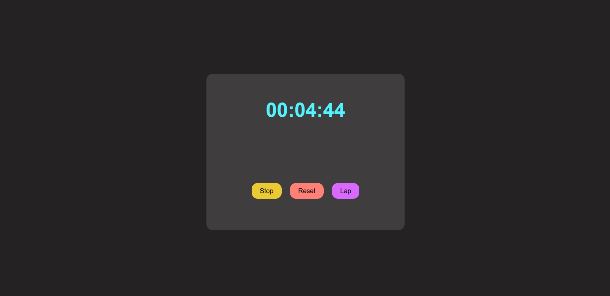
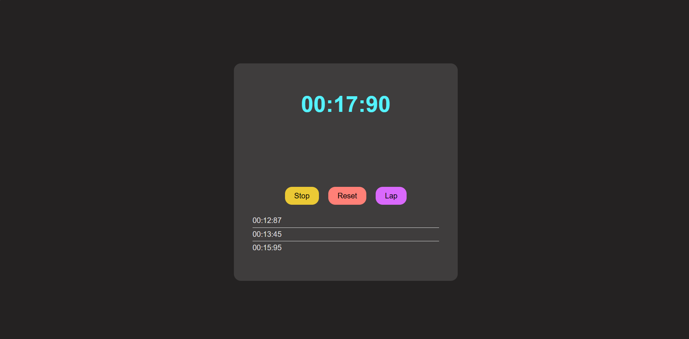

# Stopwatch Web Application

This project is a stopwatch web application built using HTML, CSS, and JavaScript. The application allows users to start, pause, and reset the stopwatch, as well as track and display lap times.

## Technologies Used

- **HTML:** For structuring the application elements.
- **CSS:** For styling the application.
- **JavaScript:** For implementing the stopwatch functionality.

## Features

- **Start, Pause, and Reset:** Basic stopwatch functionalities to control time measurement.
- **Lap Times:** Ability to record and display lap times.
- **Interactive UI:** User-friendly and interactive interface.

## Screenshots

- **Start Time:**

- **Lap Times:**

---
